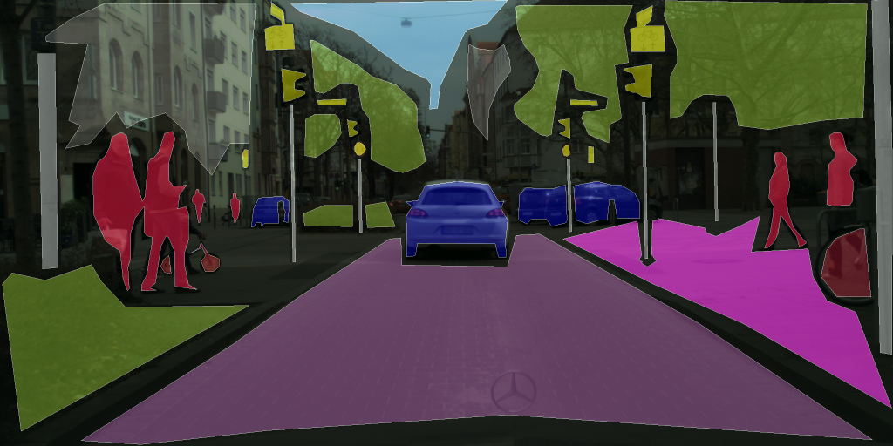
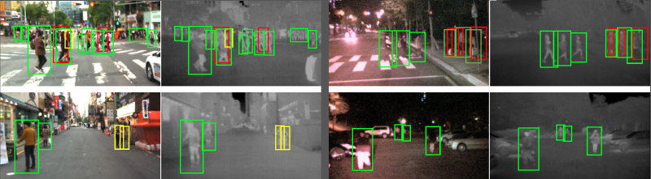

# Overview

To narrow our search for applicable object detection models, the following key considerations are made:

1. Fast response (close to real-time detection)
2. Detection of moving/static objects (Increase usefulness for our depth detection)
3. Detection of specific set of objects (not all objects) catered towards pedestrians

Additionally, the model should be implementable on the follow device options:

1. Mobile devices
2. Edge devices (Jetson, RaspberryPi, etc.)
3. Smart glasses

These considerations narrows the scope of research.

When considering fast models for object detection, YOLO is a well established model framework. The following YOLO  YOLO (You Only Look Once) frameworks have potential for our project:

+ YOLOv8
+ YOLOv8-Nano 
+ YOLO-NAS
+ YOLOv5
+ YOLOv4-Tiny
+ NanoDet

  

# Preliminary Information

First of all, the following terms and descriptions need to be well understood:

### What is YOLO model arcitecture?

### What is an anchor-free model?

An image is processed to have grid-like regions to specify unique areas. These areas may have an object completely within them, partly within them, or not at all in them. Each object of interest is thought to have a bounding box around it (implicitly if the data is live images; explicity if it is ground truth training imgaes). The bounding box is a simplified outline of the object to separate it from the image scene.

The grid region (also called 'grid cell') in which the center of the object's bounding box falls, is responsibile for an approximation guess of the object's bounding box. Therefore, think of each grid region as an entity which will do a guess if it detects a possible object's center in its cell.

The aproximated guess of the grid region is done with a weighted point. The point is a fixed reference. The point should attempt to know the deviation perfectly from the reference point to the object's center point. From here, a box estimation of height and width around such point is made. Ideally, the grid cell's guess will know the exact deviation with the object's center and the guessed height and width of the objet's bounding box will be exact.

In an achor-based approach, object's are treated as boxes, and anchor boxes are set to reshape and best match an object. In an anchor-free approach, object's are treated as points, and reference point are used to locate objects via deviations and object width and height.

We favor anchor-free approach because it takes lots of computation poewr to design and reshape boxes with each iteration of processing. More anchor boxes mean more complexity. This needs to be avoided in a lightweight approach.

According to ChatGPT and the sources listed below, here are the list of options for anchor-free implementation:

+ FCOS (Fully Convolutional One-Stage Object Detection)

+ CenterNet

+ CornerNet

+ ExtremeNet

+ Keypoint-based YOLO (YOLOv8, YOLO-NAS)

+ DETR (Detection Transformer)

+ DETR Variants

+ RepPoints

We will look through each one to determine our choice of model.

https://learnopencv.com/centernet-anchor-free-object-detection-explained/

https://learnopencv.com/fcos-anchor-free-object-detection-explained/
https://arxiv.org/pdf/1904.01355

### What is NAS-Optimized?

### How does image segmentation differ from image pixelation?

### What is model speed?

### What is model accuracy?

### What is model size?

### What is efficiency?

### What is edge AI suitability?

### What is low-light performance?

  

# Model Assessment

The following outlines each listed model's features.

  

# !! NOTE: BELOW THIS POINT HAS NOT BEEN VETTED FOR PLAGARISM AVOIDANCE, DO NOT READ WITHOUT THE UNDERSTANDING THAT BELOW IS A SECITON STILL IN WORK (I.E. SOME AREAS STILL NEED SOURCES) !!

## YOLOv8
https://github.com/ultralytics/ultralytics

Features:

+ State-of-the-art real-time object detection.
+ Improved backbone and neck architecture over YOLOv5.
+ Supports object detection, segmentation, and classification.
+ Efficient model scaling for different versions (Nano, Small, Medium, Large, XLarge).
+ Stronger anchor-free detection mechanism.
+ Optimized for deployment on edge devices.

## YOLOv8-Nano

Features:

+ Extremely lightweight variant of YOLOv8.
+ Designed for mobile and edge AI applications.
+ Lower computational cost with minimal accuracy drop.
+ Efficient in real-time processing on embedded devices.

## YOLO-NAS

Features:

+ Neural Architecture Search (NAS) optimized version of YOLO.
+ Highly efficient with better accuracy vs. speed trade-off.
+ Designed for real-time deployment on edge devices.
+ Improved detection robustness for small and occluded objects.
+ Supports multi-task learning (detection, segmentation).

## 4. YOLOv5
Features:

+ Highly popular and widely used for object detection.
+ Multiple model sizes: Nano, Small, Medium, Large, Extra-Large.
+ Good balance between speed and accuracy.
+ Robust pre-trained models available.
+ Easy to fine-tune and deploy.

## YOLOv4-Tiny

Features:

+ Lightweight version of YOLOv4 for embedded systems.
+ Lower latency and power consumption.
+ Uses CSPDarknet backbone for better efficiency.
+ Faster inference compared to YOLOv4 but with reduced accuracy.

## NanoDet

Features:

+ Ultralightweight object detection model.
+ Optimized for mobile CPUs and ARM-based devices.
+ Anchor-free detection with minimal computational overhead.
+ Lower accuracy compared to larger YOLO models but highly efficient.

Is 97 fps on a mobile ARM CPU

34.3 mAP

10.23 ms

<1.8MB

  

## Benchmark Assessment

Here's a comparative chart for the features of the mentioned object detection models:  

| Feature          | YOLOv8        | YOLOv8-Nano | YOLOFastestV2      | YOLOv5        | YOLOv4-Tiny   | NanoDet       |
|-----------------|--------------|-------------|--------------|--------------|--------------|--------------|
| **Model Type**  | Anchor-free  | Anchor-free | NAS-optimized | Anchor-based | Anchor-based | Anchor-free  |
| **Speed**       | Fast         | ~5ms/img   | ~10ms/img         | Fast         | ~4-5ms/img    | ~3-4ms/img |
| **Accuracy**    | High         | 37.3    | 24.1    | High         | Moderate     | 20.6    |
| **Size**        | Medium-Large | ~3-4 MB      | ~30 MB      | ~14 MB      | ~6 MB       | ~1.8 MB   |
| **Efficiency**  | High         | Very High   | High         | Moderate     | High         | Extremely High |
| **Edge Device Compatability** | Moderate | Excellent | Good         | Moderate     | Excellent    | Excellent    |
| **Low-Light Adaptable** | Yes       | Yes       | Yes         | Moderate     | No           | No           |
| **Mobile Compatability** | No       | Yes       | No          | No           | Yes          | Yes          |

https://github.com/Qengineering/YoloX-ncnn-Jetson-Nano?tab=readme-ov-file

These ratings are given based on benchmark assessments found in the sources in the source section of this document.

To expedite model decision making, we decided to use public benchmark assessments instead of running local benchmark assessments for every optional model. In doing so, we required the public benchmarks to have been performed on the COCO dataset. We understand hardware variabilty and protocol variability could alter benchmark metrics in an illegitmate way when comparing models.

### Speed
Measured in latency (ms per image).

### Accuracy (Mean Average Precision - mAP)

mAP measures object detection performance.
Larger, more advanced architectures perform better due to improved feature extraction.

YOLO-NAS: 55-57%
YOLOv8: 50-54%
YOLOv5: 48-52%
YOLOv4-Tiny: 35-40%
NanoDet: 30-35%

### Model Size (File Size & Parameter Count)

Measured in Megabytes (MB)

NanoDet: ~1 MB
YOLOv8-Nano: ~3-4 MB
YOLOv4-Tiny: ~6 MB
YOLOv5-Small: ~14 MB
YOLO-NAS: ~30 MB

### Efficiency (Computational Resource Usage)

Efficiency = Accuracy vs. Compute Trade-off.
Smaller models are efficient, larger models demand more power.

NanoDet runs efficiently on ARM CPUs & Raspberry Pi.
YOLOv8-Nano is optimized for mobile but keeps some accuracy.
YOLO-NAS needs GPUs or TPUs to perform well.

### Edge AI Suitability (Deployment on Mobile & IoT Devices)

Can the model run smoothly on mobile CPUs (e.g., Snapdragon, Jetson Nano)?

NanoDet runs on Raspberry Pi, Jetson Nano
YOLOv8-Nano works on Android/iOS
YOLO-NAS & YOLOv8 need stronger hardware

### Low-Light Performance (Robustness in Dark Environments)

Low-light performance depends on feature extraction quality.
Larger models capture more details, improving detection in the dark.

YOLOv8 handles low-light well due to feature enhancement
YOLOv4-Tiny struggles due to fewer layers capturing fine details

## Existing Datasets

### Cityscapes Dataset
https://www.cityscapes-dataset.com/

### Kaist Dataset
https://github.com/SoonminHwang/rgbt-ped-detection

### FLIR Dataset
https://www.flir.com/oem/adas/adas-dataset-form/

+ https://www.nightowls-dataset.org/
+ https://github.com/cs-chan/Exclusively-Dark-Image-Dataset
+ https://www.kaggle.com/datasets/kalvinquackenbush/caltechpedestriandataset

## Above models in use (and their limitations)

## Our model approach

## Sources

https://www.mdpi.com/2073-431X/13/12/336
https://www.mdpi.com/2504-4990/5/4/83
https://github.com/srebroa/awesome-yolo
https://github.com/roboflow/notebooks/discussions/125
https://www.vietanh.dev/blog/yolo-nas
https://www.youtube.com/watch?pp=ygUII3lvbG92OGw%3D&v=_ON9oiT_G0w
https://learnopencv.com/yolo-nas/
https://thefuturefeed.medium.com/yolo-nas-decis-new-sota-object-detection-model-that-outperforms-yolov5-yolov6-yolov7-and-yolov8-a3fc1785320a
https://www.researchgate.net/publication/379748121_YOLOv5_vs_YOLOv8_Performance_Benchmarking_in_Wildfire_and_Smoke_Detection_Scenarios
https://blog.roboflow.com/guide-to-yolo-models/

<<<<<<< HEAD
https://learnopencv.com/centernet-anchor-free-object-detection-explained/ An explanation to anchors in object detection.

https://learnopencv.com/fcos-anchor-free-object-detection-explained/ An explanation of Fully Convolutional One-Stage (FCOS) object detection model using anchor-free approach to object boundaries.

https://arxiv.org/pdf/1904.01355

https://www.mdpi.com/2073-431X/13/12/336?utm_source=chatgpt.com Low-light source for YOLOv8

# Idea Board

+ Make confirmation of followed instructions

> "Object right. 10 seconds"

> "Walk left"

> "5 seconds"

> "Walk left"

> *Ding*

The ding means they walked left enough to clear the object.

+ I argue time provides better obstacle awareness than distance or # of steps

+ For presentation day, we can create a leaderboard on how fast someone can navigated while simulating blindness.
=======
#### Do we want anchor-free detection?

#### What is the maximum time to detection that we want to have?

#### 
>>>>>>> 65dfba94f770964cd0dfde218721dfc6695aab42

